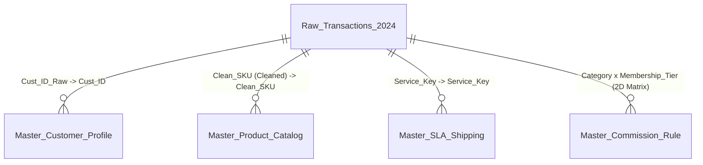

# 📊 Advanced Technical Assessment: Senior / Mid-Level Data Analyst
**Perusahaan:** PT Omnichannel Commerce Indonesia (Retail & Logistics Analytics)  
**Posisi Target:** Data Analyst / Business Intelligence Analyst / Analytics Engineer  
**Tingkat Kesulitan:** Intermediate - Advanced (Complex Data Cleansing, Multi-Table Lookup, SLA Calculations, Financial Logic, & RFM Segmentation)  

---

## 🎯 Ringkasan & Tujuan Studi Kasus
Selamat datang di **Advanced Data Analytics Technical Test**! Proyek ini disimulasikan berdasarkan skenario riil di perusahaan omnichannel e-commerce dan logistik terkemuka di Indonesia.

Sebagai seorang **Data Analyst**, Anda diminta untuk mengolah raw data transaksi tahun 2024 yang tidak rapi (*dirty data*), mengintegrasikan 5 tabel data terpisah, menerapkan logika bisnis & finansial yang kompleks, menghitung performa SLA pengiriman (menggunakan hari kerja/business days), serta membangun segmen pelanggan berbasis **RFM (Recency, Frequency, Monetary)**.

---

## 📁 Struktur Berkas & Dataset
Seluruh file data mentah berformat `.csv` telah tersedia di folder `dataset_csv/`:

1. 📄 `Raw_Transactions_2024.csv` (100 transaksi): Data mentah transaksi dengan format SKU dirty, ID spasi berlebih, tanggal order, voucher, kurir, dll.
2. 📄 `Master_Product_Catalog.csv` (15 produk): Katalog produk berisi `Clean_SKU`, `Product_Name`, `Category`, `Sub_Category`, `Unit_Price`, `Unit_COGS`, `Weight_KG`.
3. 📄 `Master_Customer_Profile.csv` (10 pelanggan): Profil pelanggan berisi `Cust_ID`, `Raw_Name`, `Raw_Phone`, `Region`, `City`, `Join_Date`, `Membership_Tier`.
4. 📄 `Master_SLA_Shipping.csv` (6 layanan kurir): Master tarif & SLA pengiriman berisi `Service_Key`, `Courier_Name`, `Service_Type`, `SLA_Days`, `Base_Rate_Per_KG`.
5. 📄 `Master_Commission_Rule.csv` (4 kategori): Matriks komisi 2-dimensi berdasarkan Kategori Produk dan Tier Keanggotaan Pelanggan.

---

## 🗺️ Skema Relasi Antar Tabel (Data Architecture)



---

## 📋 Daftar Modul & Instruksi Soal (22 Soal Berjenjang)

### 🧹 Modul 1: Data Cleansing & Text Parsing (Soal 1 - 5)
Di sheet utama `Raw_Transactions_2024`:
* **Soal 1 (`Clean_Cust_ID` - Kolom M):** Hilangkan spasi berlebih di awal/akhir dari `Cust_ID_Raw` (Kolom C) agar dapat di-lookup dengan akurat.
* **Soal 2 (`Clean_Cust_Name` - Kolom N):** Ambil nama pelanggan dari `Master_Customer_Profile` berdasarkan `Clean_Cust_ID`, bersihkan spasi ganda/berlebih, dan format menjadi *Proper Case* (kapital di setiap awal kata).
* **Soal 3 (`Clean_Phone_Number` - Kolom O):** Ambil no. HP dari `Master_Customer_Profile`, hilangkan spasi/strip/tanda `+`, dan standarkan formatnya agar selalu diawali dengan prefix `628...` (misal: `08123...` -> `628123...`, `+62 818...` -> `62818...`).
* **Soal 4 (`Clean_SKU` - Kolom P):** Bersihkan `Raw_SKU` (Kolom D) dengan menghilangkan prefix non-standar seperti `OLD_`, `NEW-`, `PROD_`, serta suffix seperti `-v1` atau `-2024` sehingga menghasilkan format SKU baku (`PRD-ELEC-xxx`, `PRD-FASH-xxx`, dll.).
* **Soal 5 (`Tracking_Code` - Kolom Q):** Buat Kode Tracking standar dengan menggabungkan: `Service_Key` + `"-"` + `Trx_ID` + `"-"` + `Clean_SKU`. (Contoh: `JNT-EXP-TRX-2024-0001-PRD-ELEC-001`).

---

### 🔍 Modul 2: Advanced Multi-Table Lookup & Relational Joining (Soal 6 - 9)
* **Soal 6 (`Product_Name`, `Category`, `Sub_Category`, `Unit_Price`, `Unit_COGS`, `Weight_KG` - Kolom R s/d W):** Tari/Lookup detail informasi produk dari `Master_Product_Catalog` berdasarkan `Clean_SKU` (Kolom P). Gunakan `XLOOKUP` atau `INDEX-MATCH` dengan penanganan error `#N/A`.
* **Soal 7 (`Customer_Region`, `Membership_Tier` - Kolom X, Y):** Tarik wilayah pelanggan (`Region`) dan `Membership_Tier` dari `Master_Customer_Profile` menggunakan `Clean_Cust_ID`.
* **Soal 8 (`Courier_Name`, `Service_Type`, `SLA_Days`, `Base_Rate_Per_KG` - Kolom Z s/d AC):** Tarik data ekspedisi dari `Master_SLA_Shipping` berdasarkan `Service_Key` (Kolom G).
* **Soal 9 (`Sales_Commission_Rate` - Kolom AD):** Tarik persen komisi sales dari matriks 2D di `Master_Commission_Rule` berdasarkan kombinasi **`Category`** (Baris) dan **`Membership_Tier`** (Kolom). *(Hint: Gunakan `INDEX` + `MATCH` ganda atau `XLOOKUP` terbilang/nested).*

---

### 🚚 Modul 3: SLA Pengiriman & Business Days Analytics (Soal 10 - 12)
* **Soal 10 (`Dispatch_Duration_Days` - Kolom AE):** Hitung berapa hari durasi pemrosesan dari `Order_Date` sampai barang diserahkan ke kurir (`Ship_Date`).
* **Soal 11 (`Actual_Delivery_Business_Days` - Kolom AF):** Hitung durasi pengiriman sebenarnya dari `Ship_Date` sampai `Delivery_Date` dalam satuan **Hari Kerja saja** (tidak menghitung hari Sabtu & Minggu). *(Hint: Gunakan fungsi `NETWORKDAYS` atau `NETWORKDAYS.INTL`).*
* **Soal 12 (`SLA_Status` & `Late_Penalty_Amount` - Kolom AG & AH):**
  - **`SLA_Status`:** Jika `Actual_Delivery_Business_Days` <= `SLA_Days` (Kolom AB), berikan status `"On-Time"`, jika melebihi berikan status `"Late Delivery"`.
  - **`Late_Penalty_Amount`:** Jika status `"Late Delivery"`, dikenakan denda keterlambatan sebesar **Rp 25.000 per hari keterlambatan** (`Actual_Delivery_Business_Days - SLA_Days`). Jika `"On-Time"`, denda = `0`.

---

### 💰 Modul 4: Complex Financial Engine & Revenue Logic (Soal 13 - 16)
* **Soal 13 (`Total_Weight_KG` & `Shipping_Cost` - Kolom AI & AJ):**
  - `Total_Weight_KG` = `Qty` * `Weight_KG`.
  - `Shipping_Cost` = `Total_Weight_KG` * `Base_Rate_Per_KG`.
* **Soal 14 (`Voucher_Discount_Amount` - Kolom AK):** Hitung nilai diskon voucher berdasarkan aturan bisnis berikut:
  - Jika `Voucher_Code` = `"FLAT50K"` -> Potongan flat **Rp 50.000**.
  - Jika `Voucher_Code` = `"DISC10"` -> Diskon **10%** dari Gross Revenue (`Qty * Unit_Price`).
  - Jika `Voucher_Code` = `"DISC20MAX30K"` -> Diskon **20%** dari Gross Revenue, tetapi dibatasi maksimal **Rp 30.000** (`MIN`).
  - Jika `Voucher_Code` = `"FREESHIP"` -> Potongan sebesar 100% dari `Shipping_Cost` (gratis ongkir).
  - Jika `Voucher_Code` = `"-"` atau `"NONE"` -> Diskon **Rp 0**.
* **Soal 15 (`Gross_Revenue` & `Net_Revenue` - Kolom AL & AM):**
  - `Gross_Revenue` = `Qty` * `Unit_Price`.
  - `Net_Revenue` = `Gross_Revenue` - `Voucher_Discount_Amount`.
* **Soal 16 (`Commission_Amount` & `Net_Profit` - Kolom AN & AO):**
  - `Commission_Amount` = `Net_Revenue` * `Sales_Commission_Rate`.
  - `Net_Profit` = `Net_Revenue` - (`Qty` * `Unit_COGS`) - `Commission_Amount` - `Late_Penalty_Amount`.

---

### 📊 Modul 5: Conditional Aggregations & Executive KPI Dashboard (Soal 17 - 19)
Pada sheet terpisah **`KPI_Summary`**, buatkan tabel ringkasan eksekutif menggunakan formula agregasi bersyarat:
* **Soal 17 (Metrik Agregat Utama):**
  - Total Net Revenue (`SUM`)
  - Total Gross Profit & Net Profit (`SUM`)
  - Total Penalty Paid (`SUM`)
  - Total Trx Count (`COUNTA`)
  - Average Order Value / AOV (`AVERAGE`)
  - Overall SLA On-Time Rate % (`COUNTIFS("On-Time") / COUNTIFS(...)`)
* **Soal 18 (Performa Per Region & Per Channel):**
  - Hitung Total `Net_Revenue` dan `Net_Profit` untuk masing-masing `Region` (Jawa Barat, DKI Jakarta, Jawa Timur, dll.) menggunakan `SUMIFS`.
  - Hitung Total Trx dan Average Net Revenue per `Channel` (Tokopedia, Shopee, TikTok Shop, Website, Offline Store).
* **Soal 19 (Performa SLA Per Kurir Expeidisi):**
  - Hitung % On-Time SLA Rate untuk masing-masing Kurir (`J&T Express`, `JNE`, `SiCepat`) menggunakan kombinasi `COUNTIFS`.

---

### 👑 Modul 6: Customer RFM Behavioral Analytics (Soal 20 - 22)
Pada sheet terpisah **`Customer_RFM_Analysis`**, lakukan analisis segmentasi pelanggan per `Cust_ID` berdasarkan data transaksi 2024:
*(Catatan: Gunakan tanggal acuan/cutoff date analisis = `2024-12-31`)*
* **Soal 20 (Perhitungan RFM Raw Values):**
  - **Recency (R):** Jumlah hari sejak transaksi terakhir pelanggan hingga `2024-12-31` (`2024-12-31 - MAXIFS(Order_Date)`).
  - **Frequency (F):** Total frekuensi transaksi pelanggan (`COUNTIFS(Cust_ID)`).
  - **Monetary (M):** Total akumulasi `Net_Revenue` dari pelanggan tersebut (`SUMIFS(Net_Revenue)`).
* **Soal 21 (RFM Scoring - Skala 1 s/d 3):**
  - **Recency Score (R_Score):** `R <= 60 hari` -> Score 3; `61 - 120 hari` -> Score 2; `> 120 hari` -> Score 1.
  - **Frequency Score (F_Score):** `F >= 12 kali` -> Score 3; `7 - 11 kali` -> Score 2; `< 7 kali` -> Score 1.
  - **Monetary Score (M_Score):** `M >= Rp 10.000.000` -> Score 3; `Rp 5.000.000 - Rp 9.999.999` -> Score 2; `< Rp 5.000.000` -> Score 1.
* **Soal 22 (RFM Customer Segment Logic):**
  - Tentukan Segmen Pelanggan berdasarkan kombinasi Skor:
    - Jika `R_Score = 3` DAN `F_Score = 3` DAN `M_Score = 3` -> **`"Champions"`**
    - Jika `F_Score >= 2` DAN `M_Score >= 2` -> **`"Loyal Customers"`**
    - Jika `R_Score = 1` DAN `F_Score >= 2` -> **`"At-Risk Customers"`**
    - Jika `R_Score = 1` DAN `F_Score = 1` -> **`"Lost Customers"`**
    - Selainnya -> **`"Potential Loyalist"`**

---

## 🔑 KUNCI JAWABAN & PEMBAHASAN FORMULA LENGKAP

Berikut adalah panduan kunci jawaban dan penjelasan logika formula langkah demi langkah:

### 🛠️ Modul 1: Pembersihan Data & Teks
| No | Kolom Target | Formula Excel Rekomendasi | Alternate / Classic Formula | Penjelasan Logika |
|---|---|---|---|---|
| 1 | `Clean_Cust_ID` (Col M) | `=TRIM(C2)` | `=CLEAN(TRIM(C2))` | Membuang spasi liar di awal/akhir ID. |
| 2 | `Clean_Cust_Name` (Col N) | `=PROPER(TRIM(XLOOKUP(M2, Master_Customer_Profile!$A$2:$A$11, Master_Customer_Profile!$B$2:$B$11)))` | `=PROPER(TRIM(VLOOKUP(M2, Master_Customer_Profile!$A$2:$G$11, 2, FALSE)))` | Mengambil nama mentah dari master, membuang spasi ganda, dan mengubah format teks menjadi Proper Case (Awal kata kapital). |
| 3 | `Clean_Phone_Number` (Col O) | `=LET(raw, SUBSTITUTE(SUBSTITUTE(SUBSTITUTE(XLOOKUP(M2, Master_Customer_Profile!$A$2:$A$11, Master_Customer_Profile!$C$2:$C$11), " ", ""), "-", ""), "+", ""), IF(LEFT(raw,2)="08", "628"&MID(raw,3,LEN(raw)), IF(LEFT(raw,2)="62", raw, "62"&raw)))` | `=SUBSTITUTE(...)` | Membersihkan simbol `+`, `-`, dan spasi, kemudian mengganti awalan `08` menjadi `628` agar terstandarisasi internasional. |
| 4 | `Clean_SKU` (Col P) | `=SUBSTITUTE(SUBSTITUTE(SUBSTITUTE(SUBSTITUTE(D2, "OLD_", ""), "NEW-", ""), "-v1", ""), "-2024", "")` | `=SUBSTITUTE(...)` | Menghapus semua prefix/suffix pengganggu sehingga menyisakan format murni `PRD-xxxx-xxx`. |
| 5 | `Tracking_Code` (Col Q) | `=G2&"-"&A2&"-"&P2` | `=CONCAT(G2, "-", A2, "-", P2)` | Menggabungkan kode service, ID transaksi, dan SKU bersih menggunakan penggabung string `&`. |

---

### 🔍 Modul 2: Multi-Table Lookup
| No | Kolom Target | Formula Excel Rekomendasi (`XLOOKUP`) | Formula Classic (`INDEX-MATCH` / `VLOOKUP`) |
|---|---|---|---|
| 6a | `Product_Name` (Col R) | `=XLOOKUP(P2, Master_Product_Catalog!$A$2:$A$16, Master_Product_Catalog!$B$2:$B$16, "Not Found")` | `=INDEX(Master_Product_Catalog!$B$2:$B$16, MATCH(P2, Master_Product_Catalog!$A$2:$A$16, 0))` |
| 6b | `Category` (Col S) | `=XLOOKUP(P2, Master_Product_Catalog!$A$2:$A$16, Master_Product_Catalog!$C$2:$C$16)` | `=VLOOKUP(P2, Master_Product_Catalog!$A$2:$G$16, 3, FALSE)` |
| 6c | `Sub_Category` (Col T) | `=XLOOKUP(P2, Master_Product_Catalog!$A$2:$A$16, Master_Product_Catalog!$D$2:$D$16)` | `=VLOOKUP(P2, Master_Product_Catalog!$A$2:$G$16, 4, FALSE)` |
| 6d | `Unit_Price` (Col U) | `=XLOOKUP(P2, Master_Product_Catalog!$A$2:$A$16, Master_Product_Catalog!$E$2:$E$16)` | `=VLOOKUP(P2, Master_Product_Catalog!$A$2:$G$16, 5, FALSE)` |
| 6e | `Unit_COGS` (Col V) | `=XLOOKUP(P2, Master_Product_Catalog!$A$2:$A$16, Master_Product_Catalog!$F$2:$F$16)` | `=VLOOKUP(P2, Master_Product_Catalog!$A$2:$G$16, 6, FALSE)` |
| 6f | `Weight_KG` (Col W) | `=XLOOKUP(P2, Master_Product_Catalog!$A$2:$A$16, Master_Product_Catalog!$G$2:$G$16)` | `=VLOOKUP(P2, Master_Product_Catalog!$A$2:$G$16, 7, FALSE)` |
| 7a | `Customer_Region` (Col X) | `=XLOOKUP(M2, Master_Customer_Profile!$A$2:$A$11, Master_Customer_Profile!$D$2:$D$11)` | `=VLOOKUP(M2, Master_Customer_Profile!$A$2:$G$11, 4, FALSE)` |
| 7b | `Membership_Tier` (Col Y) | `=XLOOKUP(M2, Master_Customer_Profile!$A$2:$A$11, Master_Customer_Profile!$G$2:$G$11)` | `=VLOOKUP(M2, Master_Customer_Profile!$A$2:$G$11, 7, FALSE)` |
| 8a | `Courier_Name` (Col Z) | `=XLOOKUP(G2, Master_SLA_Shipping!$A$2:$A$7, Master_SLA_Shipping!$B$2:$B$7)` | `=VLOOKUP(G2, Master_SLA_Shipping!$A$2:$E$7, 2, FALSE)` |
| 8b | `Service_Type` (Col AA) | `=XLOOKUP(G2, Master_SLA_Shipping!$A$2:$A$7, Master_SLA_Shipping!$C$2:$C$7)` | `=VLOOKUP(G2, Master_SLA_Shipping!$A$2:$E$7, 3, FALSE)` |
| 8c | `SLA_Days` (Col AB) | `=XLOOKUP(G2, Master_SLA_Shipping!$A$2:$A$7, Master_SLA_Shipping!$D$2:$D$7)` | `=VLOOKUP(G2, Master_SLA_Shipping!$A$2:$E$7, 4, FALSE)` |
| 8d | `Base_Rate_Per_KG` (Col AC) | `=XLOOKUP(G2, Master_SLA_Shipping!$A$2:$A$7, Master_SLA_Shipping!$E$2:$E$7)` | `=VLOOKUP(G2, Master_SLA_Shipping!$A$2:$E$7, 5, FALSE)` |
| 9 | `Sales_Commission_Rate` (Col AD) | `=INDEX(Master_Commission_Rule!$B$2:$E$5, MATCH(S2, Master_Commission_Rule!$A$2:$A$5, 0), MATCH(Y2&"_Rate", Master_Commission_Rule!$B$1:$E$1, 0))` | `=XLOOKUP(S2, Master_Commission_Rule!$A$2:$A$5, XLOOKUP(Y2&"_Rate", Master_Commission_Rule!$B$1:$E$1, Master_Commission_Rule!$B$2:$E$5))` |

---

### 🚚 Modul 3: SLA & Business Days
| No | Kolom Target | Formula Excel | Penjelasan |
|---|---|---|---|
| 10 | `Dispatch_Duration_Days` (Col AE) | `=H2 - B2` | Selisih Tanggal Ship minus Tanggal Order (dalam satuan hari). |
| 11 | `Actual_Delivery_Business_Days` (Col AF) | `=NETWORKDAYS(H2, I2) - 1` | Menghitung jumlah hari kerja antara Tanggal Ship & Delivery (dikurangi 1 agar mengukur selisih durasi kerja murni tanpa menghitung hari Sabtu & Minggu). |
| 12a | `SLA_Status` (Col AG) | `=IF(AF2 <= AB2, "On-Time", "Late Delivery")` | Mengecek apakah durasi kerja pengiriman melampaui batas SLA. |
| 12b | `Late_Penalty_Amount` (Col AH) | `=IF(AG2="Late Delivery", (AF2 - AB2) * 25000, 0)` | Denda Rp 25.000 per hari jika status pengiriman terlambat. |

---

### 💰 Modul 4: Kalkulasi Finansial & Diskon
| No | Kolom Target | Formula Excel | Penjelasan Logika |
|---|---|---|---|
| 13a | `Total_Weight_KG` (Col AI) | `=E2 * W2` | `Qty` dikali `Weight_KG` per unit. |
| 13b | `Shipping_Cost` (Col AJ) | `=AI2 * AC2` | `Total_Weight_KG` dikali tarif dasar kurir per KG. |
| 14 | `Voucher_Discount_Amount` (Col AK) | `=IFS(F2="FLAT50K", 50000, F2="DISC10", 0.10 * (E2*U2), F2="DISC20MAX30K", MIN(0.20 * (E2*U2), 30000), F2="FREESHIP", AJ2, TRUE, 0)` | Multi-conditional rule engine menggunakan `IFS` / `IF` nested untuk kalkulasi variasi diskon. |
| 15a | `Gross_Revenue` (Col AL) | `=E2 * U2` | `Qty * Unit_Price`. |
| 15b | `Net_Revenue` (Col AM) | `=AL2 - AK2` | Gross Revenue dikurangi potongan voucher. |
| 16a | `Commission_Amount` (Col AN) | `=AM2 * AD2` | Net Revenue dikali persen komisi sales. |
| 16b | `Net_Profit` (Col AO) | `=AM2 - (E2 * V2) - AN2 - AH2` | Net Revenue dikurangi total HPP (`Qty * Unit_COGS`), komisi sales, dan denda keterlambatan SLA. |

---

### 📊 Modul 5: Executive KPI Dashboard (Sheet `KPI_Summary`)
* **Total Net Revenue:** `=SUM(Raw_Transactions_2024!AM2:AM101)`
* **Total Net Profit:** `=SUM(Raw_Transactions_2024!AO2:AO101)`
* **Total Late Penalty Paid:** `=SUM(Raw_Transactions_2024!AH2:AH101)`
* **Average Order Value (AOV):** `=AVERAGE(Raw_Transactions_2024!AM2:AM101)`
* **Overall SLA On-Time Rate (%):** `=COUNTIF(Raw_Transactions_2024!AG2:AG101, "On-Time") / COUNTA(Raw_Transactions_2024!AG2:AG101)`
* **Net Revenue Per Region (Jawa Barat):** `=SUMIFS(Raw_Transactions_2024!$AM$2:$AM$101, Raw_Transactions_2024!$X$2:$X$101, "Jawa Barat")`
* **On-Time Rate J&T Express (%):** `=COUNTIFS(Raw_Transactions_2024!$Z$2:$Z$101, "J&T Express", Raw_Transactions_2024!$AG$2:$AG$101, "On-Time") / COUNTIF(Raw_Transactions_2024!$Z$2:$Z$101, "J&T Express")`

---

### 👑 Modul 6: RFM Customer Segmentation (Sheet `Customer_RFM_Analysis`)
Asumsi `A2` berisi `Cust_ID` (`CUST-001`), Cutoff Date = `DATE(2024,12,31)`:

1. **Recency (Hari):** `=DATE(2024,12,31) - MAXIFS(Raw_Transactions_2024!$B$2:$B$101, Raw_Transactions_2024!$M$2:$M$101, A2)`
2. **Frequency (Jumlah Trx):** `=COUNTIF(Raw_Transactions_2024!$M$2:$M$101, A2)`
3. **Monetary (Total Spending):** `=SUMIF(Raw_Transactions_2024!$M$2:$M$101, A2, Raw_Transactions_2024!$AM$2:$AM$101)`
4. **R_Score:** `=IF(B2 <= 60, 3, IF(B2 <= 120, 2, 1))`
5. **F_Score:** `=IF(C2 >= 12, 3, IF(C2 >= 7, 2, 1))`
6. **M_Score:** `=IF(D2 >= 10000000, 3, IF(D2 >= 5000000, 2, 1))`
7. **Customer Segment:**
   ```excel
   =IFS(
       AND(E2=3, F2=3, G2=3), "Champions",
       AND(F2>=2, G2>=2), "Loyal Customers",
       AND(E2=1, F2>=2), "At-Risk Customers",
       AND(E2=1, F2=1), "Lost Customers",
       TRUE, "Potential Loyalist"
   )
   ```

---

## 💡 Tip Sukses Pengerjaan Ujian
1. **Pahami Struktur Referensi Mutlak (`$`)**: Pastikan selalu mengunci range master table (`$A$2:$G$16`) agar formula tidak bergeser saat di-copy-paste ke bawah.
2. **Manfaatkan `LET` / Modern Functions**: Penggunaan `XLOOKUP`, `IFS`, dan `LET` membuat formula jauh lebih pendek, bersih, dan mudah di-debug daripada Nested IF klasik.
3. **Validasi Tipe Data Tanggal**: Pastikan kolom tanggal di-format sebagai `Date` bukan `Text` agar fungsi `NETWORKDAYS` bekerja sempurna.
4. **Cek Edge Cases**: Perhatikan kondisi batas seperti transaksi tanpa voucher (`"-"`), kurir terlambat tepat 1 hari, dan rounding angka desimal pada persentase.

*Selamat berlatih dan tingkatkan keahlian analitis spreadsheet Anda ke level profesional!*
