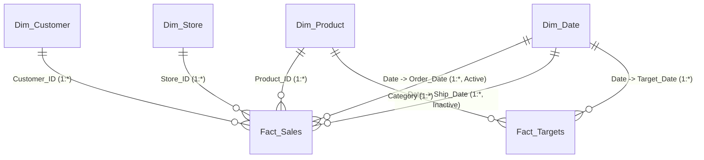

# 📊 Technical Assessment: Power BI & Business Intelligence Analyst
**Perusahaan:** PT Nusantara Retail Analytics (Omnichannel E-Commerce & Retail)  
**Posisi Target:** Data Analyst / Business Intelligence Analyst / Power BI Developer  
**Tingkat Kesulitan:** Intermediate – Advanced (Power Query ETL, Star Schema Modeling, Advanced DAX, Time Intelligence, UI/UX Dashboarding, RLS, & Strategic Business Insights)  

---

## 🎯 Ringkasan & Skenario Studi Kasus

Selamat datang di **Power BI Technical Assessment Project**! Proyek ini dirancang menyerupai studi kasus nyata di industri ritel modern dan *e-commerce omnichannel* di Indonesia.

### 🏢 Latar Belakang Perusahaan
**PT Nusantara Retail Analytics** mengoperasikan bisnis ritel yang terbagi ke dalam 5 kanal penjualan:
1. *Marketplace:* Tokopedia, Shopee, TikTok Shop
2. *Direct-to-Consumer (D2C):* Official Website
3. *Physical Retail:* 14 Flagship Store, Mall Outlets, dan Standalone Stores yang tersebar di kota-kota besar di Indonesia (Jawa & Luar Jawa).

Manajemen eksekutif membutuhkan dashboard interaktif berbasis **Power BI Desktop** yang komprehensif, dinamis, dan berperforma tinggi untuk memantau:
1. **Performa Finansial & Penjualan:** Revenue, COGS, Gross Profit, Margin %, serta pencapaian terhadap target bulanan per kategori.
2. **Tren Waktu (Time Intelligence):** Pertumbuhan *Year-over-Year (YoY)* dan *Month-over-Month (MoM)*.
3. **Analisis Pelanggan & Wilayah:** Segmentasi konsumen, sebaran geografis (Jawa vs Luar Jawa), serta pelanggan dengan kontribusi terbesar (*Pareto principle*).
4. **Efisiensi Operasional & Logistik:** Ketepatan waktu pengiriman (*On-Time Delivery Rate* SLA) antar kurir ekspedisi.
5. **Keamanan Data (Row-Level Security):** Pembatasan hak akses data per Regional Manager (Jawa vs Luar Jawa).

---

## 📁 Struktur Berkas & Dataset

Seluruh dataset mentah berformat `.csv` telah tersedia di folder `dataset_csv/`:

| Nama File | Jumlah Baris | Deskripsi Data |
|---|---|---|
| 📄 `Fact_Sales.csv` | 1.600 transaksi | Data transaksi penjualan (2023 - 2024), mencakup `Order_ID`, `Order_Date`, `Ship_Date`, `Customer_ID`, `Product_ID`, `Store_ID`, `Channel`, `Courier`, `Payment_Method`, `Qty`, `Unit_Price`, `Discount_Rate`, `Delivery_Status`. |
| 📄 `Dim_Product.csv` | 30 produk | Data master katalog produk (`Product_ID`, `Product_Name`, `Category`, `Sub_Category`, `Unit_Cost`, `Base_Price`). |
| 📄 `Dim_Customer.csv` | 100 pelanggan | Profil master pelanggan (`Customer_ID`, `Customer_Name`, `Customer_Segment`, `City`, `Province`, `Region`, `Join_Date`). |
| 📄 `Dim_Store.csv` | 15 toko/cabang | Data master toko dan fulfilment hub (`Store_ID`, `Store_Name`, `Store_Type`, `City`, `Province`, `Region`, `Manager_Name`). |
| 📄 `Dim_Date.csv` | 731 hari | Data referensi kalender (1 Jan 2023 – 31 Des 2024) berisi atribut kalender lengkap. |
| 📄 `Monthly_Sales_Targets_Raw.csv` | 5 kategori | Data target penjualan bulanan 2024 dalam format melebar (*wide matrix*) yang memerlukan unpivot di Power Query. |

---

## 🗺️ Skema Relasi Model Data (Star Schema Architecture)

Model data yang wajib Anda bangun di Power BI mengikuti kaidah **Star Schema** dengan tabel fakta di tengah dan tabel dimensi di sekelilingnya:

> [!IMPORTANT]
> **Kaidah Utama Data Modeling:**
> - Seluruh relasi bersifat **One-to-Many (`1:*`)** dengan arah cross-filter **Single (Dimensi memfilter Fakta)**.
> - Relasi `Dim_Date[Date]` ke `Fact_Sales[Order_Date]` berstatus **Active**.
> - Relasi `Dim_Date[Date]` ke `Fact_Sales[Ship_Date]` berstatus **Inactive** (digunakan untuk kalkulasi berbasis tanggal pengiriman via DAX `USERELATIONSHIP`).

---

## 📋 Daftar Modul & Instruksi Pengerjaan (22 Soal Berjenjang)

---

### 🧹 Modul 1: Data Ingestion & Power Query Transformation (ETL) (Soal 1 – 5)

Buka Power BI Desktop, kemudian muat file dari folder `dataset_csv/` ke dalam Power Query Editor:

* **Soal 1 (Verifikasi & Standarisasi Tipe Data):**
  - Pastikan `Order_Date` dan `Ship_Date` pada `Fact_Sales` berformat tipe data **Date**.
  - Pastikan kolom nominal harga dan biaya (`Unit_Price`, `Unit_Cost`, `Base_Price`) berformat tipe data **Currency / Decimal Number**.
  - Pastikan kolom diskon (`Discount_Rate`) berformat tipe data **Percentage** atau **Decimal Number** (antara `0.00` hingga `0.20`).
  - Pastikan kolom `Qty` bertipe **Whole Number (Integer)**.

* **Soal 2 (Pembersihan Teks & Format String):**
  - Pada `Dim_Customer` dan `Dim_Store`, pastikan kolom teks seperti `Customer_Name`, `City`, dan `Store_Name` tidak memiliki spasi liar di awal/akhir (*Trim*).
  - Terapkan fungsi *Capitalize Each Word* (*Proper Case*) pada kolom nama agar representasi visual seragam.

* **Soal 3 (Custom Conditional Column - Sales Channel Grouping):**
  - Pada tabel `Fact_Sales`, tambahkan sebuah Custom Column bernama **`Channel_Group`**:
    - Jika `Channel` = `"Offline Store"`, maka `"Physical Retail"`.
    - Selain itu, isi dengan `"E-Commerce / Online"`.

* **Soal 4 (Custom Column - Dispatch Duration):**
  - Pada tabel `Fact_Sales`, buat kolom kustom baru bernama **`Dispatch_Duration_Days`**:
    - Hitung selisih hari antara `Ship_Date` dan `Order_Date` (`Duration.Days([Ship_Date] - [Order_Date])`).
    - Pastikan bertipe data **Whole Number**.

* **Soal 5 (Unpivoting Table - Monthly Sales Targets):**
  - Muat tabel `Monthly_Sales_Targets_Raw.csv`.
  - Tabel ini saat ini memiliki 12 kolom target (`Target_2024_01` s/d `Target_2024_12`).
  - Lakukan operasi **Unpivot Columns** pada kolom target tersebut agar berubah menjadi struktur tabel transaksional vertikal:
    - Ubah nama kolom atribut menjadi **`Target_Month_Code`** (contoh isi: `Target_2024_01`).
    - Ubah nama kolom nilai menjadi **`Target_Amount`** (tipe data Currency / Decimal Number).
  - Tambahkan kolom tanggal baru bernama **`Target_Date`** yang merepresentasikan hari pertama pada bulan target tersebut (contoh: `Target_2024_01` menjadi `2024-01-01`).
  - Ubah nama tabel query ini menjadi **`Fact_Targets`**.

---

### 📐 Modul 2: Data Modeling, Relationships & Calendar Table (Soal 6 – 9)

Tutup dan terapkan perubahan di Power Query (*Close & Apply*), lalu masuk ke tampilan **Model View**:

* **Soal 6 (Pembuatan DAX Date Dimension - Alternatif Dinamis):**
  - Buat tabel kalender baru menggunakan formula DAX dengan nama **`Dim_Date_DAX`** (atau gunakan `Dim_Date` yang telah disediakan) yang mencakup rentang tanggal dari `2023-01-01` sampai `2024-12-31`.
  - Kolom yang wajib ada: `Date`, `Year`, `Quarter`, `Month_Number`, `Month_Name`, `Year_Month`, `Day_Name`, `Is_Weekend`.
  - Terapkan fitur **Mark as Date Table** pada tabel kalender tersebut dengan memilih kolom `Date`.

* **Soal 7 (Pengurutan Kolom Kronologis / Sort by Column):**
  - Agar urutan bulan pada visual grafik tidak alfabetis (April, Agustus, Des...), atur kolom **`Month_Name`** untuk diurutkan berdasarkan kolom **`Month_Number`** (*Sort by Column*).
  - Lakukan hal yang sama untuk nama hari (`Day_Name` diurutkan berdasarkan `Day_Of_Week`).

* **Soal 8 (Pembangunan Relasi Star Schema):**
  - Hubungkan relasi antar tabel sesuai arsitektur data:
    - `Dim_Product[Product_ID]` (1) -> `Fact_Sales[Product_ID]` (*)
    - `Dim_Customer[Customer_ID]` (1) -> `Fact_Sales[Customer_ID]` (*)
    - `Dim_Store[Store_ID]` (1) -> `Fact_Sales[Store_ID]` (*)
    - `Dim_Date[Date]` (1) -> `Fact_Sales[Order_Date]` (*) [**Status: Active**]
    - `Dim_Date[Date]` (1) -> `Fact_Sales[Ship_Date]` (*) [**Status: Inactive**]
    - `Dim_Product[Category]` (1) -> `Fact_Targets[Category]` (*)
    - `Dim_Date[Date]` (1) -> `Fact_Targets[Target_Date]` (*)
  - Pastikan seluruh arah kardinalitas adalah **One-to-Many (`1:*`)** dengan cross-filter direction **Single**.

* **Soal 9 (Best Practice Model Governance):**
  - Buat satu tabel kosong khusus untuk menampung seluruh measure kalkulasi bernama **`_AllMeasures`**.
  - Sembunyikan (*Hide in Report View*) seluruh kolom Foreign Key pada tabel fakta (`Fact_Sales[Product_ID]`, `Fact_Sales[Customer_ID]`, dll.) agar pengguna laporan diarahkan menggunakan kolom atribut dari tabel dimensi.

---

### ⚡ Modul 3: DAX Measures & Analytics Calculations (Soal 10 – 17)

Buat seluruh measure berikut di dalam tabel **`_AllMeasures`**:

#### A. Base Financial & Operational Measures
* **Soal 10 (Total Revenue, Total COGS, & Profit):**
  - **`Total Gross Sales`**: Total penjualan kotor sebelum diskon (`Qty * Unit_Price`).
  - **`Total Net Sales`**: Total penjualan bersih setelah memperhitungkan `Discount_Rate` (`SUMX(Fact_Sales, Fact_Sales[Qty] * Fact_Sales[Unit_Price] * (1 - Fact_Sales[Discount_Rate]))`).
  - **`Total COGS`**: Total harga pokok penjualan (`SUMX(Fact_Sales, Fact_Sales[Qty] * RELATED(Dim_Product[Unit_Cost]))`).
  - **`Total Gross Profit`**: Selisih antara penjualan bersih dan modal (`[Total Net Sales] - [Total COGS]`).
  - **`Gross Profit Margin %`**: Persentase margin laba kotor terhadap penjualan bersih (`DIVIDE([Total Gross Profit], [Total Net Sales], 0)`).

* **Soal 11 (Order Metrics & AOV):**
  - **`Total Orders`**: Jumlah unik pesanan yang tercatat (`DISTINCTCOUNT(Fact_Sales[Order_ID])`).
  - **`Total Quantity Sold`**: Total kuantitas barang terjual (`SUM(Fact_Sales[Qty])`).
  - **`Average Order Value (AOV)`**: Nilai rata-rata per transaksi pesanan (`DIVIDE([Total Net Sales], [Total Orders], 0)`).

#### B. Inactive Relationship & Logical Filtering
* **Soal 12 (Sales by Ship Date via Inactive Relationship):**
  - Manajemen logistik ingin melihat nilai penjualan berdasarkan tanggal pengiriman barang, bukan tanggal order.
  - Buat measure **`Sales by Ship Date`** menggunakan fungsi `CALCULATE` dan `USERELATIONSHIP` untuk mengaktifkan relasi `Fact_Sales[Ship_Date]` dengan `Dim_Date[Date]`.

* **Soal 13 (Conditional Channel Measures):**
  - **`Online Sales Revenue`**: Penjualan bersih khusus untuk kanal transaksi online (`Tokopedia`, `Shopee`, `TikTok Shop`, `Official Website`).
  - **`Offline Store Sales Revenue`**: Penjualan bersih khusus transaksi di toko fisik (`Offline Store`).
  - **`Online Sales Contribution %`**: Persentase kontribusi omzet online terhadap keseluruhan penjualan.

#### C. Time Intelligence Calculations (YoY & MoM)
* **Soal 14 (Year-over-Year & Month-over-Month Growth):**
  - **`Sales SPLY` (Same Period Last Year):** Nilai penjualan pada periode yang sama di tahun sebelumnya (`CALCULATE([Total Net Sales], SAMEPERIODLASTYEAR(Dim_Date[Date]))`).
  - **`YoY Sales Growth (IDR)`**: Selisih nominal penjualan tahun berjalan dengan tahun sebelumnya (`[Total Net Sales] - [Sales SPLY]`).
  - **`YoY Sales Growth %`**: Persentase pertumbuhan penjualan terhadap tahun lalu (`DIVIDE([YoY Sales Growth (IDR)], [Sales SPLY], 0)`).
  - **`Sales YTD` (Year-to-Date):** Akumulasi penjualan dari awal tahun kalender hingga tanggal yang dipilih (`TOTALYTD([Total Net Sales], Dim_Date[Date])`).
  - **`Sales MTD` (Month-to-Date):** Akumulasi penjualan dari awal bulan kalender (`TOTALMTD([Total Net Sales], Dim_Date[Date])`).

#### D. Target vs Actual Variance Analysis
* **Soal 15 (Performance Target Tracking):**
  - **`Total Target Sales`**: Total target penjualan dari tabel fakta target (`SUM(Fact_Targets[Target_Amount])`).
  - **`Sales vs Target Variance`**: Selisih antara realisasi penjualan bersih dengan target (`[Total Net Sales] - [Total Target Sales]`).
  - **`Target Achievement %`**: Persentase ketercapaian target penjualan (`DIVIDE([Total Net Sales], [Total Target Sales], 0)`).

#### E. Advanced DAX (Ranking, Iterators & SLA Analytics)
* **Soal 16 (Top Customer Sales Rank):**
  - Buat measure **`Customer Sales Rank`** untuk meranking pelanggan berdasarkan `Total Net Sales` secara dinamis sesuai konteks filter visual:
    - Gunakan fungsi `RANKX` dikombinasikan dengan `ALLSELECTED(Dim_Customer[Customer_Name])` dan opsi urutan `DESC`, `Dense`.

* **Soal 17 (Logistics SLA On-Time Delivery Rate %):**
  - Buat measure **`On-Time Orders Count`**: Jumlah pesanan dengan status `"On-Time"`.
  - Buat measure **`SLA On-Time Rate %`**: Persentase pesanan yang terkirim tepat waktu terhadap total pesanan (`DIVIDE([On-Time Orders Count], [Total Orders], 0)`).

---

### 📊 Modul 4: Interactive Report Canvas & Visual Analytics (Soal 18 – 20)

Rancang laporan multi-halaman (*3 Halaman Laporan*) dengan tata letak profesional, palet warna harmonis (misal: Navy & Teal modern), dan tipografi modern (Segoe UI / Din):

* **Soal 18 (Halaman 1: Executive Business Overview):**
  - **Top Banner KPI Cards:**
    1. `Total Net Sales` (beserta *Callout Value* YoY Growth % dengan warna dinamis hijau jika positif, merah jika negatif).
    2. `Total Gross Profit` & `Profit Margin %`.
    3. `Total Orders` & `AOV`.
    4. `% Target Achievement` (menampilkan status *gauge* atau *KPI card*).
  - **Visual Utama (Monthly Sales vs Target):**
    - Line & Clustered Column Chart yang membandingkan `Total Net Sales` (batang) dengan `Total Target Sales` (garis) per bulan di tahun 2024.
  - **Visual Kategori (Sales & Margin Breakdown):**
    - Bar Chart atau Treemap yang menampilkan kontribusi `Total Net Sales` dan `Profit Margin %` per Kategori Produk.
  - **Filter Interaktif (Global Slicers):**
    - Slicer Tahun (`Year`), Slicer Kuartal (`Quarter`), dan Slicer Wilayah (`Region`: Jawa / Luar Jawa).

* **Soal 19 (Halaman 2: Customer & Channel Deep-Dive):**
  - **Matrix Visual (Customer Performance Table):**
    - Baris: `Customer_Segment` dan `Customer_Name` (mendukung *Drill-down*).
    - Nilai: `Total Orders`, `Total Net Sales`, `Gross Profit Margin %`, `Customer Sales Rank`.
    - Terapkan **Conditional Formatting (Data Bars)** pada kolom `Total Net Sales` dan warna latar gradien (*Color Scale*) pada `Gross Profit Margin %`.
  - **Top 10 Customers Visual:**
    - Clustered Bar Chart menampilkan 10 Pelanggan dengan omzet terbesar (gunakan Top N Filter pada visual level).
  - **Channel Contribution Visual:**
    - Donut Chart / 100% Stacked Bar Chart yang menunjukkan porsi penjualan antar kanal (`Tokopedia`, `Shopee`, `TikTok Shop`, `Official Website`, `Offline Store`).

* **Soal 20 (Halaman 3: Logistics & Operational Efficiency):**
  - **Courier SLA Performance Matrix:**
    - Baris: `Courier`.
    - Kolom Metrik: `Total Orders`, `On-Time Orders Count`, `SLA On-Time Rate %`, rata-rata `Dispatch_Duration_Days`.
    - Berikan aturan kondisional ikon tanda centang hijau jika SLA >= 92%, dan tanda silang merah jika < 92%.
  - **Delivery Trend by Ship Date:**
    - Area Chart atau Line Chart yang menggunakan measure `Sales by Ship Date` pada sumbu waktu tanggal pengiriman.
  - **Interactivity Feature (Custom Tooltip Page):**
    - Buat sebuah halaman *Tooltip* khusus berukuran kecil (Tooltip Page) bernama **`Product_Tooltip`**.
    - Ketika kursor pengguna diarahkan ke salah satu kategori produk di Halaman 1, tampilkan detail Top 3 Produk terlaris di kategori tersebut beserta persentase marginnya.

---

### 🔒 Modul 5: Row-Level Security (RLS) & Strategic Business Insights (Soal 21 – 22)

* **Soal 21 (Penerapan Row-Level Security / RLS):**
  - Manajemen menginginkan agar Manager Regional hanya dapat melihat data transaksi pelanggan di wilayah operasinya:
    1. Buat Role RLS bernama **`Regional_Manager_Jawa`** dengan filter DAX pada tabel `Dim_Customer` atau `Dim_Store`:
       - `[Region] = "Jawa"`
    2. Buat Role RLS bernama **`Regional_Manager_Luar_Jawa`**:
       - `[Region] = "Luar Jawa"`
    3. Lakukan pengujian peran menggunakan fitur **View as Roles** pada tab Modeling dan buktikan bahwa nilai penjualan pada dashboard terfilter sesuai wilayah masing-masing.

* **Soal 22 (Interpretasi Data & Rekomendasi Strategis Bisnis):**
  - Berdasarkan visualisasi dan data yang telah Anda bangun, jawablah 3 pertanyaan analisis bisnis strategis berikut dalam bentuk ringkasan eksekutif (tuliskan pada berkas teks/markdown pendukung):
    1. **Pertumbuhan Omzet:** Berapa persentase pertumbuhan penjualan bersih (*YoY Net Sales Growth %*) dari tahun 2023 ke 2024? Faktor kategori mana yang menjadi pendorong (*growth driver*) utama?
    2. **Pencapaian Target 2024:** Kategori produk manakah yang mengalami *underperformance* terbesar terhadap target bulanan 2024, dan apa rekomendasi taktis Anda untuk tim komersial?
    3. **Evaluasi SLA Ekspedisi:** Ekspedisi manakah yang memiliki tingkat keterlambatan pengiriman tertinggi (*lowest on-time SLA*), dan kanal penjualan mana yang paling rentan terdampak?

---

## 🏆 Rubrik Penilaian & Skor (Total 100 Poin)

| Modul | Fokus Penilaian | Bobot Poin |
|---|---|---|
| **Modul 1: Power Query ETL** | Ketepatan tipe data, pembersihan string, Custom Columns, dan keberhasilan Unpivot tabel target. | **20 Poin** |
| **Modul 2: Data Modeling** | Desain Star Schema, konfigurasi relasi (Active vs Inactive), pembuatan Date dimension, dan Sort by column. | **15 Poin** |
| **Modul 3: DAX Calculations** | Keakuratan formula Base Measures, USERELATIONSHIP, Time Intelligence (YoY/MTD), Variance Target, dan Ranking. | **30 Poin** |
| **Modul 4: UI/UX & Visuals** | Kerapian tata letak 3 halaman dashboard, visual hierarchy, conditional formatting, slicers, dan implementasi Tooltip Page. | **20 Poin** |
| **Modul 5: RLS & Insights** | Keberhasilan konfigurasi Row-Level Security dan ketajaman analisis bisnis dalam menjawab pertanyaan strategis. | **15 Poin** |
| **TOTAL** | **Standar Kelulusan: >= 80 Poin** | **100 Poin** |

---

## 💡 Panduan Pengumpulan Jawaban
1. Simpan lembar kerja Power BI Anda dalam format berkas **`.pbix`** dengan format penamaan:  
   `[NamaLengkap]_Technical_Assessment_PowerBI.pbix`
2. Sertakan ringkasan jawaban analisis bisnis (Soal 22) dalam format dokumen PDF atau Markdown.
3. Kunci jawaban formula dan panduan langkah teknis lengkap dapat dilihat pada file:  
   [KUNCI_JAWABAN_DAN_DAX_SOLUTIONS.md](file:///c:/Users/Asus/Documents/Project/Data-Analyst/Exam/Power%20BI/KUNCI_JAWABAN_DAN_DAX_SOLUTIONS.md)

*Selamat mengerjakan dan sukses dalam menguasai kompetensi Business Intelligence tingkat profesional!*
