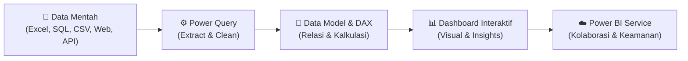
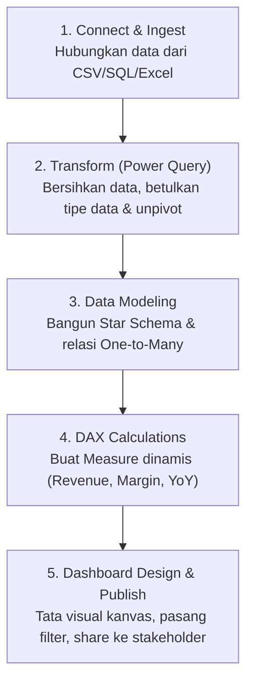

# 📘 Modul 01: Pengenalan & Antarmuka Power BI Desktop

---

## 🎯 Tujuan Pembelajaran
Setelah menyelesaikan modul ini, Anda diharapkan mampu:
1. Memahami posisi dan peran **Power BI** dalam alur kerja data analytics modern.
2. Membedakan ekosistem Power BI (*Desktop*, *Service*, *Mobile*, *Gateway*).
3. Menguasai navigasi antarmuka Power BI Desktop (**4 View Utama** dan **Panel Kontrol**).
4. Memahami siklus hidup (*lifecycle*) pembuatan dashboard BI dari awal hingga publikasi.
5. Melakukan impor dataset pertama dan membuat visualisasi sederhana.

---

## 1. Apa itu Power BI & Mengapa Sangat Populer?

**Microsoft Power BI** adalah platform analitik bisnis dan visualisasi data interaktif terkemuka yang mengubah data mentah dari berbagai sumber menjadi wawasan bisnis (*actionable insights*) yang kohesif, interaktif, dan mudah dipahami oleh pengambil keputusan.



### ⚖️ Perbandingan Peran Tools di Dunia Data
| Alat | Peran Utama | Kapan Digunakan? | Keterbatasan |
|---|---|---|---|
| **Microsoft Excel** | Ad-hoc calculation, spreadsheet, pemodelan keuangan sederhana. | Analisis cepat skala kecil (< 1 juta baris data). | Lambat saat data besar, rawan error rumus manual, visualisasi kurang dinamis. |
| **SQL** | Querying, pengolahan, dan manipulasi data di database relasional. | Ekstraksi, filtering, dan agregasi data di tingkat server. | Tidak menyediakan antarmuka visual/dashboard bawaan untuk stakeholder bisnis. |
| **Power BI** | Business Intelligence, Data Modeling, Dashboard Interaktif & Pelaporan Otomatis. | Menyajikan KPI bisnis, visual interaktif untuk manajemen, dashboard real-time/terjadwal. | Membutuhkan pemahaman data modeling & DAX untuk metrik yang kompleks. |

---

## 2. Ekosistem Power BI

Ekosistem Power BI terdiri dari beberapa komponen yang bekerja saling melengkapi:

1. **Power BI Desktop (Gratis)**:
   - Aplikasi Windows tempat analis mendesain laporan, membersihkan data (Power Query), membangun model data (Star Schema), dan menulis rumus analitik (DAX).
2. **Power BI Service (SaaS / Cloud)**:
   - Portal berbasis cloud (`app.powerbi.com`) untuk menerbitkan (*publish*), mendistribusikan laporan ke user, mengatur jadwal pembaruan data (*scheduled refresh*), dan mengelola hak akses (*Row-Level Security*).
3. **Power BI Mobile**:
   - Aplikasi seluler (iOS & Android) untuk eksekutif memantau metrik bisnis di mana saja.
4. **On-Premises Data Gateway**:
   - Jembatan perangkat lunak aman yang menghubungkan dataset di cloud dengan database/file lokal di server kantor secara berkala.
5. **Power BI Report Server**:
   - Solusi on-premises bagi instansi yang memiliki regulasi ketat dan tidak diizinkan menaruh data di cloud publik.

---

## 3. Empat Tampilan Utama (Views) di Power BI Desktop

Pada bilah navigasi sebelah kiri Power BI Desktop, terdapat 4 tampilan utama:

```
┌────────────────────────────────────────────────────────┐
│  [📊 Report View]    -> Mendesain kanvas visual        │
│  [📋 Table View]     -> Melihat & menginspeksi tabel   │
│  [🗺️ Model View]     -> Mengatur relasi antar tabel    │
│  [⚡ DAX Query View] -> Menguji ekspresi & query DAX   │
└────────────────────────────────────────────────────────┘
```

### 1. 📊 Report View (Tampilan Laporan)
- Kanvas utama tempat Anda menata kartu KPI, grafik batang, line chart, matriks, dan slicer filter.
- Memiliki fitur kanvas responsif, pengaturan tata letak (*Desktop Layout* & *Mobile Layout*).

### 2. 📋 Table View (Tampilan Data/Tabel)
- Memungkinkan Anda menginspeksi data mentah per tabel yang telah dimuat ke dalam memori.
- Tempat melihat kolom baru (*Calculated Column*) dan memastikan tipe data sesuai.

### 3. 🗺️ Model View (Tampilan Model Relasi)
- Tempat mendefinisikan hubungan relasi (*relationships*) antar tabel (*One-to-Many*, *Many-to-One*).
- Menata skema bintang (*Star Schema*), mengatur arah cross-filter, serta menyembunyikan kolom kunci (*foreign keys*) agar tidak membingungkan pengguna laporan.

### 4. ⚡ DAX Query View (Tampilan Kueri DAX)
- Fitur modern Power BI untuk menulis, mengevaluasi, dan melakukan *debug* kueri DAX tanpa harus membuat measure sementara di kanvas laporan.

---

## 4. Anatomi Panel Kerja (Panes)

Di sebelah kanan kanvas laporan, terdapat panel-panel penting:

```
Kanvas Laporan  │  [Filters]  │  [Visualizations]  │  [Data]
                │             │                    │
                │ Filter di   │ Pilih jenis visual │ Daftar tabel
                │ visual/page │ (Bar, Line, Card)  │ & kolom data
```

1. **Panel Data (Fields)**:
   - Menampilkan daftar semua tabel yang telah dimuat beserta kolom dan *measure* yang ada. Kolom numerik biasanya ditandai dengan ikon sigma ($\Sigma$), kolom tanggal dengan ikon kalender, dan measure dengan ikon kalkulator.
2. **Panel Visualizations (Visualisasi)**:
   - Berisi katalog visual standar (Bar Chart, Line Chart, Pie Chart, Matrix, Map, dll).
   - Di tab format (ikon kuas cat), Anda dapat mengkustomisasi warna, font, judul, label data, dan latar belakang visual.
3. **Panel Filters**:
   - Mengatur cakupan filter pada 3 tingkatan:
     - *Filters on this visual* (hanya memfilter 1 visual yang dipilih).
     - *Filters on this page* (memfilter semua visual di halaman aktif).
     - *Filters on all pages* (memfilter seluruh halaman di laporan).
4. **Panel Selection & Bookmarks (Buka via Tab Menu: View)**:
   - Mengatur visibilitas elemen visual (tampilkan/sembunyikan) dan membuat *state* interaktif seperti tombol navigasi dan pop-up filter.

---

## 5. Siklus Hidup Pembuatan Laporan BI (The 5-Stage BI Lifecycle)

Sebagai analis data, jangan langsung melompat membuat visual warna-warni! Ikuti alur profesional berikut:



> [!CAUTION]
> **Kesalahan Terbesar Pemula:**
> Melewatkan tahap **Data Modeling (Tahap 3)** dan langsung menghitung rumus pada tabel tunggal yang sangat lebar (*flat table*). Hal ini menyebabkan laporan menjadi lambat, formula DAX sangat rumit, dan hasil agregasi rawan salah (*double counting*).

---

## 🧪 Latihan Mandiri 01: Impor Data Pertama

Mari lakukan praktik dasar pertama Anda:

### Skenario:
Anda ingin mengimpor data katalog produk dan menampilkan total jumlah produk per kategori.

### Langkah Kerja:
1. Jalankan aplikasi **Power BI Desktop**.
2. Pada Ribbon **Home**, klik **Get Data** > pilih **Text/CSV**.
3. Arahkan ke file sampel di repositori Anda:  
   [`Exam/Power BI/dataset_csv/Dim_Product.csv`](file:///c:/Users/Asus/Documents/Project/Data-Analyst/Exam/Power%20BI/dataset_csv/Dim_Product.csv)
4. Muncul jendela preview data. Klik tombol **Load** (atau *Transform Data* jika ingin membuka Power Query).
5. Setelah data masuk, lihat di panel **Data** di sisi kanan, tabel `Dim_Product` akan muncul.
6. Pada panel **Visualizations**:
   - Klik visual **Clustered Bar Chart** (Grafik Batang Mendatar).
   - Tarik kolom `Category` ke sumbu **Y-axis**.
   - Tarik kolom `Product_ID` ke sumbu **X-axis** (Power BI otomatis menghitung *Count of Product_ID*).
7. Selamat! Anda telah berhasil membuat visualisasi pertama Anda di Power BI.

---

## ⏭️ Langkah Selanjutnya
Setelah memahami antarmuka dasar, lanjutkan ke modul krusial berikutnya:  
👉 **[Modul 02: Data Preparation & Power Query (ETL Engine)](file:///c:/Users/Asus/Documents/Project/Data-Analyst/Power%20BI/02_Data_Preparation_Power_Query.md)**
