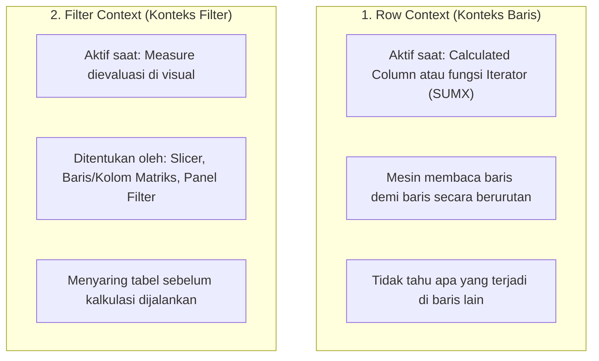

# 📘 Modul 04: Fondasi DAX (Data Analysis Expressions)

---

## 🎯 Tujuan Pembelajaran
Setelah menyelesaikan modul ini, Anda diharapkan mampu:
1. Memahami perbedaan mendasar antara **Calculated Column**, **Calculated Measure**, dan **Calculated Table**.
2. Menguasai konsep inti DAX: **Row Context**, **Filter Context**, dan **Context Transition**.
3. Menggunakan fungsi agregasi standar (`SUM`, `AVERAGE`, `DISTINCTCOUNT`).
4. Menguasai fungsi iterator (*X-Functions* seperti `SUMX` dan `AVERAGEX`).
5. Menulis logika kondisional bersih menggunakan `IF` dan `SWITCH(TRUE(), ...)`.
6. Menerapkan best practice pembuatan tabel khusus `_Measures` dan variabel `VAR ... RETURN`.

---

## 1. Apa itu DAX?

**DAX (Data Analysis Expressions)** adalah bahasa rumus dan kueri yang dirancang khusus untuk memanipulasi dan menghitung data pada model relasional tabular di Microsoft Power BI, Excel Power Pivot, dan SSAS.

Meskipun sekilas mirip dengan rumus Excel, DAX memiliki cara kerja komputasi yang sangat berbeda:
- Excel menghitung berdasarkan koordinat sel fisik (misal `=A1 * B1` atau `=SUM(C2:C100)`).
- DAX bekerja pada **tabel**, **kolom**, dan **konteks filter relasional**.

---

## 2. Calculated Column vs Measure

```
┌────────────────────────────────────────────────────────────────────────┐
│                        CALCULATED COLUMN                               │
│  - Dihitung saat proses data refresh / load.                           │
│  - Nilainya disimpan secara permanen di RAM & file .pbix per baris.   │
│  - Meningkatkan ukuran file dan konsumsi memori.                       │
│  - Dievaluasi dalam ROW CONTEXT.                                       │
│  - Kapan digunakan? Sebagai kategori filter di Slicer atau baris Matriks.│
└────────────────────────────────────────────────────────────────────────┘

┌────────────────────────────────────────────────────────────────────────┐
│                        CALCULATED MEASURE                              │
│  - Dihitung on-the-fly (real-time) hanya saat visual dirender.         │
│  - TIDAK memakan kapasitas penyimpanan disk/RAM statis.                │
│  - Beradaptasi secara dinamis terhadap slicer, baris, dan kolom.       │
│  - Dievaluasi dalam FILTER CONTEXT.                                    │
│  - Kapan digunakan? Untuk semua metrik kuantitatif (Sales, Margin, %). │
└────────────────────────────────────────────────────────────────────────┘
```

> [!TIP]
> **Aturan Praktis Data Analyst:**
> *"Jika hasilnya adalah angka agregasi yang ingin Anda lihat di kartu KPI atau grafik, buatlah **MEASURE**. Jangan membuat kolom terhitung jika bisa diselesaikan dengan measure!"*

---

## 3. Memahami Dua Konteks Evaluasi DAX

Konsep ini adalah kunci utama yang membedakan analis data biasa dengan praktisi DAX andal:



### Contoh Nyata Filter Context:
Saat Anda menaruh Measure `[Total Sales]` ke dalam tabel yang menampilkan `Dim_Product[Category]`:
1. Baris "Elektronik" secara otomatis memfilter seluruh tabel `Fact_Sales` sehingga hanya baris yang berkaitan dengan Elektronik yang tersisa.
2. Rumus `[Total Sales]` kemudian menghitung total pada baris-baris yang telah disaring tersebut.
3. Inilah yang disebut **Filter Context**.

---

## 4. Fungsi Agregasi Standar

Fungsi agregasi standar mengambil seluruh kolom sebagai argumen dan menghasilkan satu nilai skalar:

```dax
// 1. Menghitung total kuantitas unit terjual
Total Quantity = SUM(Fact_Sales[Qty])

// 2. Menghitung rata-rata nilai diskon yang diberikan
Average Discount Rate = AVERAGE(Fact_Sales[Discount_Rate])

// 3. Menghitung total transaksi unik
Total Transactions = DISTINCTCOUNT(Fact_Sales[Order_ID])

// 4. Menghitung jumlah pelanggan aktif yang berbelanja
Unique Customers = DISTINCTCOUNT(Fact_Sales[Customer_ID])

// 5. Menghitung total seluruh baris transaksi
Total Rows = COUNTROWS(Fact_Sales)
```

---

## 5. Fungsi Iterator (X-Functions)

Bagaimana jika Anda ingin menghitung Total Revenue, di mana rumusnya adalah:
$$\text{Revenue} = \text{Qty} \times \text{Unit\_Price} \times (1 - \text{Discount\_Rate})$$

Di DAX, Anda **TIDAK BISA** menulis:
```dax
// ❌ ERROR: Kolom tidak bisa dikalikan secara langsung dalam SUM sederhana
Total Revenue Error = SUM(Fact_Sales[Qty] * Fact_Sales[Unit_Price])
```

### Mengapa?
Karena fungsi `SUM()` hanya menerima **satu nama kolom tunggal**.

### Solusi: Gunakan Iterator `SUMX()`!
Fungsi berakhiran huruf **X** (*SUMX, AVERAGEX, MINX, MAXX, RANKX*) bekerja dengan cara:
1. Membuka tabel yang ditentukan.
2. Menciptakan **Row Context** dan mengevaluasi rumus ekspresi baris demi baris.
3. Menjumlahkan (atau merata-ratakan) hasil seluruh baris tersebut di akhir.

```dax
Total Gross Revenue = 
SUMX(
    Fact_Sales,
    Fact_Sales[Qty] * Fact_Sales[Unit_Price]
)

Total Net Revenue = 
SUMX(
    Fact_Sales,
    Fact_Sales[Qty] * Fact_Sales[Unit_Price] * (1 - Fact_Sales[Discount_Rate])
)
```

---

## 6. Logika Kondisional: `IF` vs `SWITCH`

### Penggunaan Fungsi `IF`:
Cocok untuk 2 percabangan sederhana:
```dax
Customer Category = 
IF(
    [Total Net Revenue] >= 50000000,
    "Tier 1 (High Value)",
    "Tier 2 (Regular)"
)
```

### Penggunaan `SWITCH(TRUE(), ...)`:
Solusi elegan terbaik daripada menggunakan `IF` bertingkat (*nested IF*) yang membingungkan:

```dax
Delivery SLA Status = 
SWITCH(
    TRUE(),
    Fact_Sales[Delivery_Days] <= 2, "Express (SLA Passed)",
    Fact_Sales[Delivery_Days] <= 4, "Regular (On Time)",
    Fact_Sales[Delivery_Days] <= 7, "Delayed (Warning)",
    "Critical Late"
)
```

---

## 7. Best Practices: Variabel (`VAR`) & Tabel Khusus Measure

### A. Selalu Gunakan Variabel (`VAR ... RETURN`)
Keuntungan menggunakan Variabel:
1. **Performa Lebih Cepat:** Ekspresi hanya dihitung 1 kali dan hasilnya disimpan di memori sementara.
2. **Mudah Dibaca & Di-debug:** Formula panjang dipecah menjadi langkah-langkah logis yang jelas.

```dax
Gross Profit Margin % = 
VAR TotalRevenue = [Total Net Revenue]
VAR TotalCost = [Total COGS]
VAR GrossProfit = TotalRevenue - TotalCost
VAR Result = 
    DIVIDE(
        GrossProfit, 
        TotalRevenue, 
        0
    )
RETURN
    Result
```

### B. Membuat Tabel Khusus Penyimpanan Measure (`_Measures`)
Agar seluruh measure terpusat rapi di bagian paling atas panel Data dan tidak bercampur dengan kolom data:
1. Pada tab **Home**, klik **Enter Data**.
2. Beri nama tabel: `_Measures` (awali dengan tanda *underscore* `_` agar otomatis berada di urutan teratas secara alfabetis).
3. Klik tombol **Load**.
4. Pindahkan measure Anda ke tabel `_Measures` (melalui tab **Measure Tools** > ubah **Home Table** ke `_Measures`).
5. Hapus kolom default `Column1` yang kosong. Ikon tabel `_Measures` akan otomatis berubah menjadi ikon kalkulator!

---

## 🧪 Latihan Mandiri 04: Membangun Core Measures

Buatlah measure-measure fundamental berikut pada tabel `_Measures` Anda:

1. **Total Orders:**
   ```dax
   Total Orders = DISTINCTCOUNT(Fact_Sales[Order_ID])
   ```
2. **Total Units Sold:**
   ```dax
   Total Units Sold = SUM(Fact_Sales[Qty])
   ```
3. **Average Order Value (AOV):**
   ```dax
   Average Order Value = 
   DIVIDE([Total Net Revenue], [Total Orders], 0)
   ```

---

## ⏭️ Langkah Selanjutnya
Setelah menguasai fondasi DAX, saatnya melangkah ke fungsi paling sakti di Power BI di:  
👉 **[Modul 05: Advanced DAX & Time Intelligence](file:///c:/Users/Asus/Documents/Project/Data-Analyst/Power%20BI/05_Advanced_DAX_Time_Intelligence.md)**
