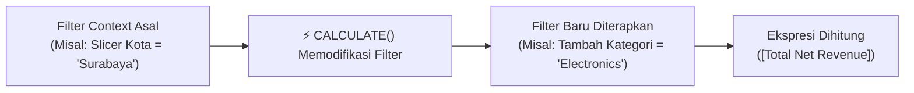

# 📘 Modul 05: Advanced DAX & Time Intelligence

---

## 🎯 Tujuan Pembelajaran
Setelah menyelesaikan modul ini, Anda diharapkan mampu:
1. Menguasai fungsi paling kuat dalam DAX: **`CALCULATE()`** dan **`CALCULATETABLE()`**.
2. Memodifikasi Filter Context menggunakan **`ALL()`**, **`ALLEXCEPT()`**, dan **`ALLSELECTED()`**.
3. Menghitung rasio kontribusi persentase terhadap total (**% of Total**).
4. Mengimplementasikan fungsi **Time Intelligence** (*YTD, QTD, MTD, SPLY, DATEADD*).
5. Membangun metrik pertumbuhan bisnis: **YoY Growth %** dan **MoM Growth %**.
6. Menghitung rata-rata bergerak (**Rolling 30-Day Moving Average**).

---

## 1. Jantung DAX: Memahami `CALCULATE()`

Di Power BI, **`CALCULATE()`** adalah satu-satunya fungsi yang memiliki kekuatan untuk **mengabaikan, menambah, atau mengubah Filter Context** yang sedang aktif di visual laporan.

### Sintaks:
```dax
CALCULATE(
    <Ekspresi / Measure>,
    <Filter 1>,
    <Filter 2>,
    ...
)
```



### Contoh Sederhana:
```dax
// Menghitung revenue khusus kanal E-Commerce terlepas dari filter channel di visual
Revenue Tokopedia = 
CALCULATE(
    [Total Net Revenue],
    Fact_Sales[Channel] = "Tokopedia"
)
```

---

## 2. Mengatur Cakupan Filter: `ALL` vs `ALLEXCEPT` vs `ALLSELECTED`

Ketiga fungsi ini sangat penting untuk menghitung metrik pangsa pasar (*market share*) atau kontribusi persentase (% of Total):

```
┌────────────────────────────────────────────────────────────────────────┐
│  ALL(Tabel/Kolom)                                                      │
│  - Menghapus SEMUA filter pada tabel atau kolom tersebut.              │
│  - Menghasilkan grand total absolut di seluruh dataset.                │
├────────────────────────────────────────────────────────────────────────┤
│  ALLEXCEPT(Tabel, Kolom_Kunci)                                         │
│  - Menghapus semua filter di tabel, KECUALI filter pada kolom_kunci.   │
│  - Berguna untuk sub-total per grup (misal subtotal per Region).       │
├────────────────────────────────────────────────────────────────────────┤
│  ALLSELECTED(Tabel/Kolom)                                              │
│  - Menghapus filter di dalam visual tabel/matriks,                     │
│  - TETAPI TETAP MEMPERTAHANKAN filter yang dipilih pengguna di Slicer! │
│  - Standar industri untuk menghitung '% of Selected Total'.           │
└────────────────────────────────────────────────────────────────────────┘
```

### Menghitung Rasio Kontribusi (% of Total):
```dax
% Revenue Contribution = 
VAR CurrentRevenue = [Total Net Revenue]
VAR TotalRevenueAllSelected = 
    CALCULATE(
        [Total Net Revenue],
        ALLSELECTED(Fact_Sales)
    )
RETURN
    DIVIDE(CurrentRevenue, TotalRevenueAllSelected, 0)
```

---

## 3. Fondasi Time Intelligence

Time Intelligence adalah kumpulan fungsi DAX untuk menganalisis metrik berdasarkan dimensi waktu (tren tahunan, bulanan, kuartalan, dan harian).

> [!IMPORTANT]
> **3 Syarat Wajib Time Intelligence:**
> 1. Memiliki tabel kalender khusus (`Dim_Date`).
> 2. Kolom tanggal harus berurutan kontinu tanpa jeda hari yang bolong (*no missing dates*).
> 3. Tabel kalender harus ditandai sebagai **Mark as Date Table**.

---

## 4. Analisis Kumulatif: YTD, QTD, MTD

Metrik kumulatif menjumlahkan performa dari awal periode kalender hingga tanggal yang sedang dievaluasi:

```dax
// 1. Year-to-Date (YTD) Revenue
Revenue YTD = 
TOTALYTD(
    [Total Net Revenue],
    Dim_Date[Date]
)

// 2. Month-to-Date (MTD) Revenue
Revenue MTD = 
TOTALMTD(
    [Total Net Revenue],
    Dim_Date[Date]
)

// 3. Quarter-to-Date (QTD) Revenue
Revenue QTD = 
TOTALQTD(
    [Total Net Revenue],
    Dim_Date[Date]
)
```

---

## 5. Analisis Perbandingan Periode Waktu Lalu (Prior Periods)

Untuk mengetahui apakah bisnis kita bertumbuh, kita harus membandingkannya dengan periode yang sama di tahun atau bulan sebelumnya:

### A. Periode yang Sama Tahun Lalu (Same Period Last Year):
```dax
Revenue SPLY = 
CALCULATE(
    [Total Net Revenue],
    SAMEPERIODLASTYEAR(Dim_Date[Date])
)
```

### B. Menggeser Periode Fleksibel dengan `DATEADD`:
Fungsi `DATEADD` sangat serbaguna karena dapat melompat mundur/maju berdasarkan Hari, Bulan, Kuartal, atau Tahun:
```dax
// Penjualan 1 Bulan Lalu (Prior Month)
Revenue Last Month = 
CALCULATE(
    [Total Net Revenue],
    DATEADD(Dim_Date[Date], -1, MONTH)
)

// Penjualan 1 Kuartal Lalu
Revenue Last Quarter = 
CALCULATE(
    [Total Net Revenue],
    DATEADD(Dim_Date[Date], -1, QUARTER)
)
```

---

## 6. Menghitung Pertumbuhan Bisnis: YoY & MoM Growth

### A. Pertumbuhan Year-over-Year (YoY):
$$\text{YoY Growth Nominal} = \text{Revenue Sekarang} - \text{Revenue Tahun Lalu}$$
$$\text{YoY Growth \%} = \frac{\text{YoY Growth Nominal}}{\text{Revenue Tahun Lalu}}$$

```dax
// Pertumbuhan Nominal (Rupiah)
Revenue YoY Growth = 
VAR CurrentRev = [Total Net Revenue]
VAR PriorRev = [Revenue SPLY]
RETURN
    IF(
        NOT ISBLANK(CurrentRev) && NOT ISBLANK(PriorRev),
        CurrentRev - PriorRev,
        BLANK()
    )

// Pertumbuhan Persentase (%)
Revenue YoY Growth % = 
VAR CurrentRev = [Total Net Revenue]
VAR PriorRev = [Revenue SPLY]
VAR Growth = CurrentRev - PriorRev
RETURN
    DIVIDE(Growth, PriorRev, BLANK())
```

### B. Pertumbuhan Month-over-Month (MoM):
```dax
Revenue MoM Growth % = 
VAR CurrentRev = [Total Net Revenue]
VAR PriorMonthRev = [Revenue Last Month]
VAR Growth = CurrentRev - PriorMonthRev
RETURN
    DIVIDE(Growth, PriorMonthRev, BLANK())
```

---

## 7. Rata-Rata Bergerak (Rolling 30-Day Moving Average)

Dalam data ritel dan e-commerce harian, grafik harian sering kali berfluktuasi sangat ekstrem (naik tajam di akhir pekan dan turun di hari kerja). Untuk melihat tren dasar yang sebenarnya, analis menggunakan **Moving Average**:

```dax
Revenue 30D Moving Average = 
VAR LastVisibleDate = MAX(Dim_Date[Date])
VAR RollingPeriod = 
    DATESINPERIOD(
        Dim_Date[Date],
        LastVisibleDate,
        -30,
        DAY
    )
VAR Result = 
    CALCULATE(
        AVERAGEX(
            VALUES(Dim_Date[Date]),
            [Total Net Revenue]
        ),
        RollingPeriod
    )
RETURN
    Result
```

---

## 🧪 Latihan Mandiri 05: Membangun Metrik Evaluasi Target

Gunakan dataset target yang telah Anda unpivot di Modul 2 untuk membuat kalkulasi pencapaian target (*Target Achievement*):

```dax
// 1. Total Target Sales
Total Target Sales = SUM(Fact_Targets[Target_Sales])

// 2. Selisih Pencapaian terhadap Target (Variance)
Sales Variance to Target = [Total Net Revenue] - [Total Target Sales]

// 3. Persentase Pencapaian Target (% Achievement)
Target Achievement % = 
DIVIDE(
    [Total Net Revenue],
    [Total Target Sales],
    0
)
```

---

## ⏭️ Langkah Selanjutnya
Setelah seluruh kalkulasi bisnis siap di memori, saatnya menyajikan data tersebut secara visual dan memikat di:  
👉 **[Modul 06: Visualisasi Data & Desain Dashboard Interaktif](file:///c:/Users/Asus/Documents/Project/Data-Analyst/Power%20BI/06_Visualisasi_dan_Desain_Dashboard.md)**
