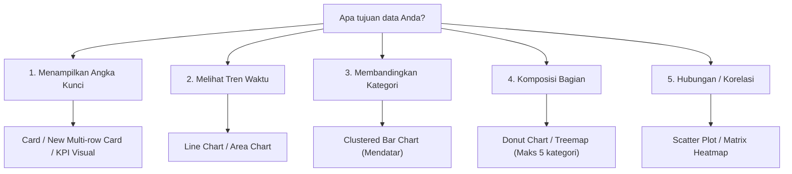

# 📘 Modul 06: Visualisasi Data & Desain Dashboard Interaktif

---

## 🎯 Tujuan Pembelajaran
Setelah menyelesaikan modul ini, Anda diharapkan mampu:
1. Menerapkan prinsip **UI/UX Dashboard Eksekutif** (*Visual Hierarchy*, *F-Pattern Layout*, *Aturan Warna 60-30-10*).
2. Memilih jenis visualisasi yang tepat sesuai dengan tujuan data (*Comparison*, *Trend*, *Composition*, *Relationship*).
3. Mengonfigurasi interaktivitas modern: **Slicers**, **Cross-filtering**, **Edit Interactions**.
4. Membangun navigasi bertingkat: **Drill-Down**, **Drill-Through Pages**, dan **Custom Report Page Tooltips**.
5. Menggunakan kombinasi **Bookmarks** dan **Selection Pane** untuk membuat tombol navigasi dinamis dan panel filter *pop-up*.

---

## 1. Prinsip Desain UI/UX Dashboard Profesional

Sebuah dashboard yang hebat bukan dashboard yang memiliki visual paling banyak atau warna paling mencolok, melainkan dashboard yang mampu **menjawab pertanyaan bisnis dalam waktu kurang dari 5 detik**.

```
┌────────────────────────────────────────────────────────────────────────┐
│                        LAYOUT STANDAR F-PATTERN                        │
│                                                                        │
│  [ 🏷️ LOGO & JUDUL LAPORAN ]                 [ 📅 SLICER PERIODE ]     │
│  ────────────────────────────────────────────────────────────────────  │
│  [ 💳 KPI 1 ]   [ 💳 KPI 2 ]   [ 💳 KPI 3 ]   [ 💳 KPI 4 ]             │
│  Total Revenue   Gross Profit    Total Orders    Target Achv %         │
│  ────────────────────────────────────────────────────────────────────  │
│  [ 📈 GRAFIK TREN WAKTU (LINE) ]    │ [ 📊 KOMPARASI KATEGORI (BAR) ] │
│  Tren Penjualan Bulanan (YoY)       │ Top 5 Kategori Terlaris         │
│  ───────────────────────────────────┼────────────────────────────────  │
│  [ 🗺️ SEBARAN GEOGRAFIS / KURIR ]   │ [ 📋 TABEL DETAIL / MATRIX ]    │
│  On-Time Delivery Rate by Courier   │ Rincian Kinerja per Cabang/Toko  │
└────────────────────────────────────────────────────────────────────────┘
```

### Kaidah Visual Hierarchy:
1. **Bagian Kiri Atas:** Area dengan fokus pandangan pertama mata (*High visual weight*). Letakkan metrik ringkasan eksekutif (KPI Cards).
2. **Bagian Tengah:** Tren historis dan perbandingan antar dimensi utama (Line Chart, Bar Chart).
3. **Bagian Bawah:** Data granular, sebaran detail, atau tabel matriks transaksional.

### Aturan Pewarnaan (Color Psychology):
- **Aturan 60-30-10:**
  - **60% Warna Netral:** Latar belakang (putih, abu-abu sangat muda `#F8F9FA`, atau *dark mode* elegan `#121212`).
  - **30% Warna Struktural / Brand:** Abu-abu gelap, biru navy, atau warna identitas perusahaan untuk chart dan header.
  - **10% Warna Aksen / Alert:** Warna kontras hanya untuk menyorot anomali bisnis (Merah untuk performa di bawah target, Hijau untuk target tercapai).
- ⚠️ **Hindari "Rainbow Dashboard":** Jangan mewarnai setiap batang grafik dengan warna berbeda jika batangnya mewakili hal yang sama!

---

## 2. Memilih Visual yang Tepat untuk Kebutuhan Bisnis



| Tipe Visual | Kapan Menggunakannya? | Kesalahan Umum yang Harus Dihindari |
|---|---|---|
| **Card (New Card Visual)** | Menampilkan angka KPI utama tunggal (misal Total Revenue). | Menaruh terlalu banyak angka tanpa konteks perbandingan (*vs Target* atau *vs YoY*). |
| **Line Chart** | Menunjukkan tren berkelanjutan dari waktu ke waktu (Harian, Bulanan). | Menggunakan line chart untuk data non-waktu (seperti nama kota). |
| **Clustered Bar Chart** | Membandingkan kategori diskrit dengan nama label yang panjang. | Menggunakan pie chart dengan lebih dari 7 kategori. |
| **Waterfall Chart** | Menunjukkan bagaimana nilai awal berubah menjadi nilai akhir (analisis kontribusi profit/biaya). | Digunakan untuk data acak non-sekuensial. |
| **Matrix Table** | Menyajikan data tabular hierarkis dengan *Conditional Formatting* (Data Bars). | Menaruh ratusan kolom teks tanpa hierarki. |

---

## 3. Mengatur Interaktivitas: Edit Interactions

Secara default, saat pengguna mengklik satu batang di grafik, Power BI melakukan **Cross-highlighting** (meredupkan bagian visual lain). Dalam banyak kasus bisnis, perilaku ini membingungkan stakeholder.

### Mengubah ke Cross-filtering Penuh:
1. Klik visual sumber.
2. Di Ribbon atas, buka tab **Format** > klik **Edit Interactions**.
3. Ikon kontrol kecil akan muncul di atas setiap visual lain di kanvas:
   - **Filter (Ikon Corong):** Memfilter visual secara penuh (sangat disarankan).
   - **Highlight (Ikon Grafik Pie):** Hanya menyorot sebagian.
   - **None (Ikon Lingkaran Coret):** Visual tidak terpengaruh sama sekali oleh klik sumber (sangat bagus untuk kartu KPI agar nilainya tetap konstan).

---

## 4. Navigasi Lanjutan: Drill-Down & Drill-Through

### A. Hierarki Drill-Down
Memungkinkan pengguna menggali data dari level makro ke level mikro di dalam visual yang sama:
- Tarik `Year`, `Quarter`, dan `Month_Name` ke sumbu X di Line Chart.
- Klik ikon tanda panah ganda ke bawah ($\downarrow\downarrow$) untuk melakukan *drill down* dari tahun ke kuartal lalu ke bulan.

### B. Drill-Through Page (Halaman Rincian Khusus)
Memungkinkan pengguna mengklik kanan pada satu pelanggan atau toko tertentu di halaman ikhtisar, lalu diarahkan ke halaman detail khusus yang terfilter secara otomatis.
- **Cara Membuat:**
  1. Buat halaman baru bernama `Store_Detail`.
  2. Pada panel **Format/Page Information**, cari bagian **Page type** > ubah menjadi **Drill-through**.
  3. Tarik field `Dim_Store[Store_Name]` ke dalam kotak **Drill-through fields**.
  4. Power BI akan secara otomatis menambahkan tombol "Back" ($\leftarrow$) di pojok kiri atas halaman!

---

## 5. Membuat Custom Tooltip (Halaman Tooltip Interaktif)

Alih-alih tooltip teks bawaan yang membosankan, Anda dapat menampilkan grafik mini saat kursor mouse diarahkan ke sebuah visual (*hover effect*):

1. Buat halaman baru (misal: `Tooltip_Trend`).
2. Masuk ke panel **Format Page** > **Canvas settings** > ubah **Type** menjadi **Tooltip**.
3. Di tab **Page information**, aktifkan sakelar **Allow use as tooltip**.
4. Buat grafik kecil di kanvas tersebut (misal Line chart tren 6 bulan terakhir).
5. Kembali ke halaman utama, pilih visual utama Anda > buka panel **Format** > **Tooltips** > ubah **Type: Report page** dan pilih `Tooltip_Trend`.

---

## 6. Bookmarks & Selection Pane: Membuat Navigasi Dinamis

Fitur **Bookmarks** merekam status (*state*) halaman laporan saat ini (filter apa yang aktif, visual apa yang terlihat atau disembunyikan).

```
┌────────────────────────────────────────────────────────┐
│  [ 🔘 Ikhtisar Penjualan ]   [ 🔘 Analisis Logistik ]  │  <-- Tombol Bookmark
└────────────────────────────────────────────────────────┘
```

### Membuat Tombol Pengganti Tampilan (Tab Switcher):
1. Buka tab **View** > centang **Bookmarks** dan **Selection**.
2. Di panel Selection, Anda akan melihat daftar seluruh elemen visual di halaman. Anda dapat menyembunyikan elemen dengan mengklik ikon mata ($\ eye $).
3. **Rekam Bookmark 1 (Tampilan Penjualan):**
   - Sembunyikan grafik logistik, tampilkan grafik penjualan.
   - Di panel Bookmarks, klik **Add** > beri nama `View_Sales`.
4. **Rekam Bookmark 2 (Tampilan Logistik):**
   - Sembunyikan grafik penjualan, tampilkan grafik logistik.
   - Di panel Bookmarks, klik **Add** > beri nama `View_Logistics`.
5. Sisipkan dua tombol (*Insert* > *Buttons* > *Blank*) di kanvas, lalu atur properti **Action**:
   - Tombol 1: Type = **Bookmark**, Destination = `View_Sales`.
   - Tombol 2: Type = **Bookmark**, Destination = `View_Logistics`.

---

## 🧪 Latihan Mandiri 06: Desain Kartu KPI Bersyarat

Buatlah kartu ringkasan KPI untuk metrik `Target Achievement %`:
1. Buat visual **Card** dengan measure `[Target Achievement %]`.
2. Format angka menjadi persentase dengan 1 desimal.
3. Tambahkan **Conditional Formatting** pada warna font (*Callout value color*):
   - Jika $\text{Value} \ge 1.0$ (100%), beri warna Hijau (`#2E7D32`).
   - Jika $\text{Value} < 1.0$, beri warna Merah (`#C62828`).

---

## ⏭️ Langkah Selanjutnya
Setelah tampilan laporan memukau dan interaktif, mari pelajari fitur analitik canggih dan kecerdasan buatan di:  
👉 **[Modul 07: Analisis Lanjutan & Fitur AI (Key Influencers & What-If)](file:///c:/Users/Asus/Documents/Project/Data-Analyst/Power%20BI/07_Analisis_Lanjutan_dan_AI.md)**
