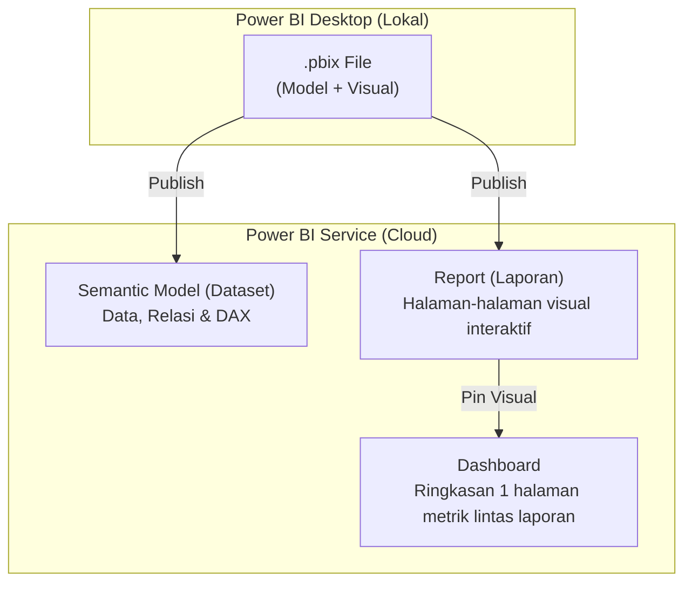

# 📘 Modul 09: Power BI Service, Kolaborasi, & Keamanan (Governance)

---

## 🎯 Tujuan Pembelajaran
Setelah menyelesaikan modul ini, Anda diharapkan mampu:
1. Memahami arsitektur **Power BI Service (Cloud)**: Semantic Models, Reports, Dashboards, dan Workspaces.
2. Mengelola hak akses tim menggunakan **Workspace Roles** (*Admin*, *Member*, *Contributor*, *Viewer*).
3. Mengonfigurasi **On-Premises Data Gateway** dan **Scheduled Refresh** otomatis.
4. Mengimplementasikan **Row-Level Security (RLS)** baik secara **Statis** maupun **Dinamis** (`USERPRINCIPALNAME()`).
5. Mempublikasikan dan mendistribusikan laporan secara aman melalui **Power BI Apps**.
6. Mengenal format modern **Power BI Project (`.pbip`)** untuk integrasi kontrol versi Git.

---

## 1. Arsitektur Power BI Service (Cloud)

Setelah selesai mendesain file di Power BI Desktop, langkah berikutnya adalah mempublikasikan (*Publish*) file tersebut ke portal cloud **Power BI Service** (`app.powerbi.com`).



### Perbedaan Report vs Dashboard:
| Fitur | Report (Laporan) | Dashboard |
|---|---|---|
| **Sumber Data** | Hanya berasal dari 1 Semantic Model tunggal. | Dapat merangkum visual dari banyak Report dan Semantic Model yang berbeda. |
| **Halaman** | Terdiri dari beberapa halaman (*multi-page*). | Tepat 1 layar tunggal (*single page tile overview*). |
| **Interaktivitas** | Slicer, drill-down, filter, dan navigasi penuh. | Mengklik tile akan langsung mengantar pengguna ke Report sumbernya. |

---

## 2. Manajemen Ruang Kerja (Workspaces & Roles)

Laporan organisasi tidak boleh disimpan di *"My Workspace"* (ruang kerja pribadi), melainkan di **Shared Workspace** departemen atau proyek.

### 4 Tingkatan Peran (*Roles*) di Workspace:
1. **Admin:** Memiliki kontrol penuh (menambah/menghapus user, menghapus workspace).
2. **Member:** Dapat menambah konten, mengedit report, dan menerbitkan Power BI App.
3. **Contributor:** Dapat mengunggah, membuat, dan mengedit konten laporan, namun tidak dapat menerbitkan App ke user umum.
4. **Viewer:** Hanya dapat melihat dan berinteraksi dengan visual dan filter laporan (tidak dapat melihat rumus DAX mentah atau mengubah visual).

---

## 3. Pembaruan Data Terjadwal (Scheduled Refresh & Data Gateway)

Laporan bisnis harus selalu mencerminkan data transaksi terbaru. Bagaimana Power BI Service di cloud mengambil data dari database lokal di kantor Anda?

```
[ Power BI Service (Cloud) ]
             ▲
             │ (Koneksi Terenkripsi Aman Port 443)
             ▼
[ On-Premises Data Gateway ] ───( Terpasang di Server Kantor )
             │
             ▼
[ Database Lokal / Folder File CSV / SQL Server Perusahaan ]
```

### Dua Jenis Gateway:
1. **Personal Mode:** Berjalan hanya saat komputer laptop analis menyala (hanya untuk pengujian pribadi).
2. **Standard Enterprise Mode:** Terpasang di server perusahaan yang beroperasi 24/7 dan melayani ratusan pengguna dan koneksi terjadwal.

---

## 4. Keamanan Data: Row-Level Security (RLS)

**Row-Level Security (RLS)** memastikan pengguna hanya melihat baris data yang menjadi hak aksesnya. Misalnya, Regional Manager Jawa tidak boleh melihat data cabang Sumatera atau Bali, meskipun mereka membuka laporan yang sama!

### A. Static RLS (Berdasarkan Aturan Statis)
1. Di Power BI Desktop, buka tab **Modeling** > klik **Manage Roles**.
2. Klik **Create** > beri nama role: `Regional_Jawa`.
3. Pilih tabel `Dim_Store` > tulis ekspresi filter DAX:
   ```dax
   [Region] = "Jawa"
   ```
4. Buat role kedua: `Regional_Luar_Jawa`:
   ```dax
   [Region] <> "Jawa"
   ```

### B. Dynamic RLS (Otomatis Berdasarkan Email Login)
Di perusahaan besar dengan ratusan manajer, membuat role statis satu per satu sangat tidak praktis. Gunakan **Dynamic RLS**:
1. Buat tabel hak akses master (misal: `User_Security`) yang memetakan email kerja ke Store_ID:

| User_Email | Store_ID |
|---|---|
| `budi.santoso@perusahaan.co.id` | `STR-001` |
| `siti.aminah@perusahaan.co.id` | `STR-002` |

2. Tulis aturan DAX pada tabel keamanan menggunakan fungsi `USERPRINCIPALNAME()`:
   ```dax
   [User_Email] = USERPRINCIPALNAME()
   ```
3. Saat Budi membuka laporan di web, Power BI otomatis mendeteksi email login Budi dan menyaring data toko hanya untuk `STR-001`.

### 🧪 Menguji RLS:
- **Di Desktop:** Buka tab **Modeling** > klik **View as** > centang role yang ingin diuji.
- **Di Power BI Service:** Klik titik tiga pada Semantic Model > pilih **Security** > klik titik tiga di sebelah nama role > pilih **Test as role**.

---

## 5. Distribusi Laporan: Power BI Apps

> [!TIP]
> **Cara Paling Profesional Mendistribusikan Laporan:**
> Jangan membagikan tautan langsung workspace kepada ratusan manajer operasional! Kemas laporan-laporan yang telah disetujui ke dalam **Power BI App**:
> - Menyediakan portal terpadu dengan navigasi menu samping yang bersih.
> - Mengunci laporan dari perubahan visual yang tidak disengaja.
> - Memudahkan pembaruan rilis berkala (*staging* vs *production*).

---

## 6. Integrasi Git & Power BI Project (`.pbip`)

Secara historis, file `.pbix` adalah file biner yang sulit dipantau perubahannya (*version control*). Dalam versi modern, Power BI mendukung format **Power BI Project (`.pbip`)**:

- Menyimpan metadata laporan dalam format teks terstruktur:
  - **TMDL (Tabular Model Definition Language):** Mendokumentasikan seluruh model data, relasi, dan DAX.
  - **Report JSON:** Mendokumentasikan tata letak visual.
- Memungkinkan tim data berkolaborasi menggunakan **Git**, melakukan *branching*, *pull requests*, dan *merge conflicts* di GitHub atau Azure DevOps!

---

## ⏭️ Langkah Selanjutnya
Sekarang Anda telah menguasai seluruh spektrum teknis Power BI. Langkah pamungkas adalah merangkai semua keahlian ini menjadi portofolio yang memikat calon perekrut di:  
👉 **[Modul 10: Proyek Portofolio End-to-End & Persiapan Karier](file:///c:/Users/Asus/Documents/Project/Data-Analyst/Power%20BI/10_Proyek_Portofolio_End_to_End.md)**
