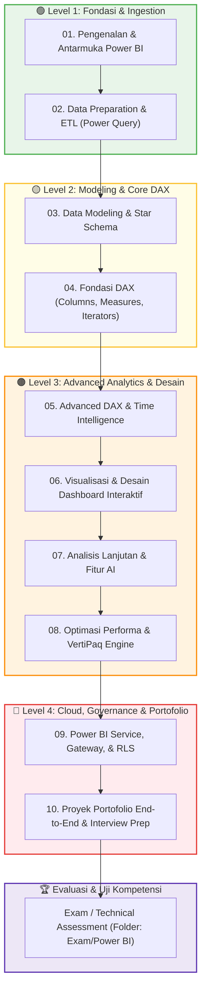

# 🚀 Kurikulum Lengkap & Roadmap Belajar Microsoft Power BI

Selamat datang di **Jalur Belajar (Learning Path) Microsoft Power BI**!  
Materi ini dirancang secara bertahap (*step-by-step*) mulai dari nol (pemula) hingga tingkat mahir (*advanced/enterprise*) untuk mempersiapkan Anda menjadi seorang **Data Analyst**, **Business Intelligence (BI) Analyst**, maupun **Power BI Developer** yang kompeten dan siap kerja di industri.

---

## 🧭 Peta Belajar (Curriculum Roadmap)

---

## 📚 Daftar Modul Pembelajaran

| No | Modul | Fokus Materi Utama | Tingkat |
|:---:|:---|:---|:---:|
| 1 | [01. Pengenalan & Antarmuka](file:///c:/Users/Asus/Documents/Project/Data-Analyst/Power%20BI/01_Pengenalan_dan_Interface.md) | Ekosistem BI, arsitektur Power BI Desktop, 4 view utama, panel navigasi, BI lifecycle. | Pemula |
| 2 | [02. Data Preparation & Power Query](file:///c:/Users/Asus/Documents/Project/Data-Analyst/Power%20BI/02_Data_Preparation_Power_Query.md) | Konsep ETL, data cleaning, data typing, Pivot vs Unpivot, Merge (JOIN), Append (UNION), M basics. | Pemula - Menengah |
| 3 | [03. Data Modeling & Star Schema](file:///c:/Users/Asus/Documents/Project/Data-Analyst/Power%20BI/03_Data_Modeling_Star_Schema.md) | Fact vs Dimension table, Star Schema, kardinalitas relasi (`1:*`), filter direction, Dim_Date. | Menengah |
| 4 | [04. Fondasi DAX](file:///c:/Users/Asus/Documents/Project/Data-Analyst/Power%20BI/04_Fondasi_DAX.md) | Calculated Column vs Measure, Row Context vs Filter Context, fungsi agregasi, Iterator (`SUMX`), `VAR/RETURN`. | Menengah |
| 5 | [05. Advanced DAX & Time Intelligence](file:///c:/Users/Asus/Documents/Project/Data-Analyst/Power%20BI/05_Advanced_DAX_Time_Intelligence.md) | `CALCULATE()`, `ALL()`, `FILTER()`, Time Intelligence (YoY, MoM, YTD), Moving Average, `DIVIDE()`. | Menengah - Mahir |
| 6 | [06. Visualisasi & Desain Dashboard](file:///c:/Users/Asus/Documents/Project/Data-Analyst/Power%20BI/06_Visualisasi_dan_Desain_Dashboard.md) | Pemilihan chart, UI/UX grid, color palette, slicers, drill-down, drill-through, bookmarks. | Menengah - Mahir |
| 7 | [07. Analisis Lanjutan & Fitur AI](file:///c:/Users/Asus/Documents/Project/Data-Analyst/Power%20BI/07_Analisis_Lanjutan_dan_AI.md) | Key Influencers, Decomposition Tree, Smart Narrative, Q&A, What-If Parameters, Field Parameters. | Mahir |
| 8 | [08. Optimasi Performa](file:///c:/Users/Asus/Documents/Project/Data-Analyst/Power%20BI/08_Optimasi_Performa.md) | VertiPaq engine, Performance Analyzer, reduksi ukuran file .pbix, optimasi DAX, DAX Studio. | Mahir |
| 9 | [09. Power BI Service & Keamanan](file:///c:/Users/Asus/Documents/Project/Data-Analyst/Power%20BI/09_Power_BI_Service_dan_Keamanan.md) | Cloud Service, Workspaces, Apps, Scheduled Refresh, Data Gateway, Row-Level Security (RLS). | Mahir / Enterprise |
| 10 | [10. Proyek Portofolio End-to-End](file:///c:/Users/Asus/Documents/Project/Data-Analyst/Power%20BI/10_Proyek_Portofolio_End_to_End.md) | Panduan portofolio industri, business storytelling, 3 skenario proyek nyata, panduan interview. | Siap Kerja |

### 📖 Dokumen Referensi Cepat (Cheatsheets)
- [DAX Cheatsheet](file:///c:/Users/Asus/Documents/Project/Data-Analyst/Power%20BI/DAX_Cheatsheet.md) - Sintaks, contoh formula, dan fungsi terpenting DAX.
- [Power Query M Cheatsheet](file:///c:/Users/Asus/Documents/Project/Data-Analyst/Power%20BI/Power_Query_M_Cheatsheet.md) - Panduan manipulasi data dan formula M di Power Query.

---

## 🛠️ Persiapan & Setup Lingkungan Belajar

Sebelum memulai Modul 1, pastikan Anda telah menyiapkan:

1. **Aplikasi Power BI Desktop (Gratis)**:
   - Unduh resmi melalui **Microsoft Store** di Windows (sangat disarankan agar mendapatkan auto-update bulanan otomatis).
   - Atau unduh manual file instalasi `.msi` dari portal resmi: [Microsoft Power BI Desktop](https://powerbi.microsoft.com/desktop/).
   - *Catatan: Power BI Desktop saat ini hanya tersedia secara native untuk sistem operasi Windows.*

2. **Akun Kerja/Sekolah atau Microsoft 365 Developer (Opsional untuk Service)**:
   - Untuk mempelajari Power BI Desktop, Anda **tidak memerlukan lisensi berbayar**.
   - Jika ingin mempraktikkan publish ke **Power BI Service (Cloud)** di Modul 9, Anda memerlukan email korporat/universitas (bukan `@gmail.com` / `@yahoo.com`) atau mendaftar gratis di [Microsoft 365 Developer Program](https://developer.microsoft.com/microsoft-365/dev-program).

3. **Dataset Praktik**:
   - Di repositori ini telah tersedia dataset ritel komprehensif di folder:  
     [`Exam/Power BI/dataset_csv/`](file:///c:/Users/Asus/Documents/Project/Data-Analyst/Exam/Power%20BI/dataset_csv/)  
     Terdiri dari: `Fact_Sales.csv`, `Dim_Product.csv`, `Dim_Customer.csv`, `Dim_Store.csv`, `Dim_Date.csv`, dan `Monthly_Sales_Targets_Raw.csv`.

---

## 🎯 Tips Sukses Belajar

> [!TIP]
> 1. **Praktik Langsung (Hands-on):** Jangan hanya membaca teori. Buka Power BI Desktop dan ketikkan rumusnya sendiri.
> 2. **Pahami "Mengapa", Bukan Sekadar Menghafal Sintaks:** Pahami alur context di DAX (*Row Context* vs *Filter Context*), karena ini membedakan seorang pemula dari seorang profesional.
> 3. **Lanjutkan ke Proyek Ujian:** Setelah menyelesaikan seluruh modul, selesaikan studi kasus ujian lengkap di [`Exam/Power BI/README_INSTRUKSI.md`](file:///c:/Users/Asus/Documents/Project/Data-Analyst/Exam/Power%20BI/README_INSTRUKSI.md) untuk menguji penguasaan materi Anda!
